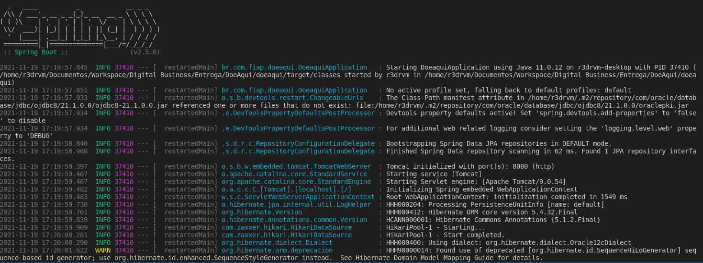
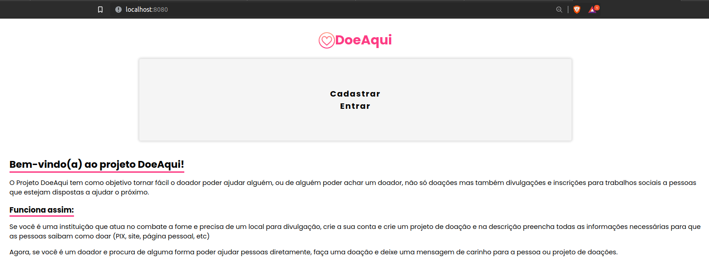

# Global Solution | DoeAqui

<table>
    <tr>
        <th>Nome</th>
        <th>RM</th>
    </tr>
    <tr>
        <td>Celso Lorensatto da Silva Filho</td>
        <td>86158</td>
    </tr>
    <tr>
        <td>Eduardo Vinícius Benigno da Costa</td>
        <td>85915</td>
    </tr>
    <tr>
        <td>Gabriel Niimi de Oliveira</td>
        <td>85499</td>
    </tr>
    <tr>
        <td>Guilherme Rodriguero de Souza</td>
        <td>83850</td>
    </tr>
    <tr>
        <td>Rogério Pizzo dos Santos</td>
        <td>84088</td>
    </tr>
</table>

<br/>

## Vídeo Explicativo

HTTPS://WWW.YOUTUBE.COM/WATCH?V=AREKGLCCV28

<br/>

## Como Executar o Projeto

<br/>

###  Requisitos:

* Maven instalado;
* Nenhum serviço rodando na porta 8080;

<br/>

### 1 - Entre no diretório ./doeaqui do projeto;
<br/>

### 2 - Abra o terminal e execute o comando abaixo:

```console
mvn spring-boot:run
```  

### 3 - Espere o Build do maven terminar

<br/>



### 4 - Abra no seu navegador a porta 8080 para acessar o projeto Spring

<br/>




